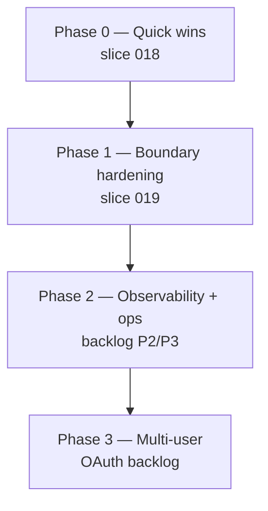

# Security audit — Maestro'D Threat Modeling

**Date:** 2026-06-09  
**Auditor role:** external PR/security review (Composer)  
**Scope:** README positioning, `SECURITY.md`, API/agent/Sentry/frontend, dependency scan  
**Repo state:** slice 017 VERIFIED · commit `d13e9e4` (local)

---

## Outcome

| Context | Verdict | Grade |
|---------|---------|-------|
| **Stated goal** — personal local threat modeling, privacy-first, localhost | **Pass** | **B+** |
| **Shared LAN / team** without extra work | **Fail** | **F** |
| **Dependency hygiene** | **Conditional** — known CVEs, CI workflow exists | **C** |

**LeadPM go/no-go:** ✅ ship for **localhost MVP** · ❌ do not promote to team/LAN until [slice 018](../specs/slice-018-security-hardening-p0.md) + [slice 019](../specs/slice-019-security-hardening-p1.md) (minimum) and [OAuth backlog](../backlog.md#p2--product).

The README and SECURITY.md are **aligned with the code**: single-user, no auth, LLM as review aid — not compliance sign-off.

---

## Checks run

| Check | Result |
|-------|--------|
| `npm audit --omit=dev` (frontend) | **0 vulnerabilities** |
| `pip-audit` (API container) | **7 CVEs** — `python-multipart 0.0.20` (6×), `weasyprint 63.1` (1×) |
| `pip-audit` (agent container) | **5 CVEs** — `langchain-core 1.2.6`, `langchain-openai 1.1.7` |
| `bash scripts/verify-pass.sh` | Green at audit time (43 passed, 1 skipped) |
| Manual code review | API upload/path, auth model, admin restore, agent diagram load, Sentry tools |

---

## Recommended hardening strategy (best order)

Strategy follows **ROI vs local-first scope**: fix real bugs and supply-chain first; defer multi-user auth until product needs it.



| Phase | Strategy | Why first | Task |
|-------|----------|-----------|------|
| **0** | **Dependency bumps** | Known CVEs; CI `security.yml` should fail | [018-R1](../specs/slice-018-security-hardening-p0.md) |
| **0** | **Path traversal fix (agent)** | API has `_safe_path`; agent does not — real read bug via dev `:8080` or poisoned restore | [018-R2](../specs/slice-018-security-hardening-p0.md) |
| **0** | **Restore guardrails** | Unbounded JSON → DoS; unvalidated `job_status`/`diagram_path` | [018-R3](../specs/slice-018-security-hardening-p0.md) |
| **1** | **Admin endpoint protection** | `/admin/restore` + `replace` = full wipe; no auth today | [019-R1](../specs/slice-019-security-hardening-p1.md) |
| **1** | **Drop `VITE_INTERNAL_API_KEY` pattern** | Key in frontend bundle = false security if API exposed | [019-R2](../specs/slice-019-security-hardening-p1.md) |
| **1** | **Inter-service auth (agent/Sentry)** | Dev profile exposes `:8080`/`:8090` without auth | [019-R3](../specs/slice-019-security-hardening-p1.md) |
| **2** | **Audit log expansion** | Delete, backup, restore, pipeline start not logged | [backlog § Security P1](../backlog.md#p1--security-hardening-post-audit--before-lanteam) |
| **2** | **Trusted proxy for rate limits** | `X-Forwarded-For` spoofing behind reverse proxy | [backlog § Security P1](../backlog.md#p1--security-hardening-post-audit--before-lanteam) |
| **3** | **OAuth / multi-user** | Only fix for shared LAN/team use | [backlog § P2](../backlog.md#p2--product) |
| **3** | **Redis rate limits** | Multi-instance / persistent limits | [backlog § P3](../backlog.md#p3--ops--scale) |

**Do not add yet (low ROI for localhost MVP):** mTLS everywhere, WAF, full RBAC — over-engineering until OAuth slice.

---

## Findings summary

### Critical — only if boundary broken (API/agent on untrusted network)

| ID | Finding | Location |
|----|---------|----------|
| C1 | No API authentication | All routes; `LOCAL_USER` stub |
| C2 | `/admin/backup` + `/admin/restore` unauthenticated; `replace` wipes catalog | `routes/admin.py` |
| C3 | Agent `:8080` + Sentry `:8090` unauthenticated in dev profile | `docker-compose.dev.yml` |

**Mitigation today:** default compose binds API to `127.0.0.1`; internal services have no host ports.

### High

| ID | Finding | Hardening task |
|----|---------|----------------|
| H1 | Agent `diagram_loader` — no path canonicalization | [018](../specs/slice-018-security-hardening-p0.md) |
| H2 | `VITE_INTERNAL_API_KEY` exposed in browser bundle | [019](../specs/slice-019-security-hardening-p1.md) |
| H3 | `INTERNAL_API_KEY` optional — empty = open mutations | [019](../specs/slice-019-security-hardening-p1.md) |
| H4 | CVEs in `python-multipart`, `weasyprint`, `langchain-*` | [018](../specs/slice-018-security-hardening-p0.md) |

### Medium

| ID | Finding | Hardening task |
|----|---------|----------------|
| M1 | Restore — no body size / row count limit | [018](../specs/slice-018-security-hardening-p0.md) |
| M2 | Restore — weak validation on `job_status.state` / `detail` | [018](../specs/slice-018-security-hardening-p0.md) |
| M3 | `GET /diagrams/{id}` — no owner filter (metadata) | [019](../specs/slice-019-security-hardening-p1.md) |
| M4 | `X-Forwarded-For` trusted for rate limits | [backlog P1](../backlog.md#p1--security-hardening-post-audit--before-lanteam) |
| M5 | Default passwords in `.env.example` | [019](../specs/slice-019-security-hardening-p1.md) |
| M6 | Sentry LLM tools mutate catalog (prompt injection) | Documented; human review mandatory |
| M7 | In-memory rate limits; disabled in dev | Backlog P3 (Redis) |

### Low / informational

| ID | Finding |
|----|---------|
| L1 | PDF export error leaks exception text |
| L2 | `replace` threat op on API — unused by UI |
| L3 | Audit log gaps (delete, admin, pipeline) |
| L4 | Backup JSON without diagram bytes — [017b](../backlog.md#p1--data-portability) |
| L5 | LLM prompt injection via description — inherent; documented |

---

## Positive controls (keep)

- API bound to `127.0.0.1:8000` in default compose
- Upload: magic bytes + 10 MB cap
- API diagram storage: `_safe_path()` traversal guard
- CORS: explicit origins, no wildcard
- Description cap 16k
- Jinja2 autoescape on PDF template
- SECURITY.md + README honest positioning
- Audit log on threat PATCH + flow scan (015)
- GitHub `security.yml` weekly pip-audit

---

## Hardening task index

| Slice / backlog | Scope | Priority |
|-----------------|-------|----------|
| [slice 018](../specs/slice-018-security-hardening-p0.md) | Deps, agent path, restore limits | **P0 — do first** |
| [slice 019](../specs/slice-019-security-hardening-p1.md) | Admin secret, mutation auth, service auth | **P1 — before LAN/team** |
| [backlog § Security P1](../backlog.md#p1--security-hardening-post-audit--before-lanteam) | Audit expansion, trusted proxy | P1–P2 |
| [backlog § P2 OAuth](../backlog.md#p2--product) | Multi-user | P2 — team use |
| [backlog § P3 Redis](../backlog.md#p3--ops--scale) | Persistent rate limits | P3 — scale |

---

## Re-run audit

After slice 018 + 019:

```bash
docker compose run --rm --no-deps api bash -c 'pip install -q pip-audit && pip-audit -r /app/requirements.txt'
docker compose run --rm --no-deps tm-agent bash -c 'pip install -q pip-audit && pip-audit -r /app/requirements.txt'
npm audit --omit=dev --prefix frontend
bash scripts/verify-pass.sh
```

Update this document with date and commit when re-audited.
